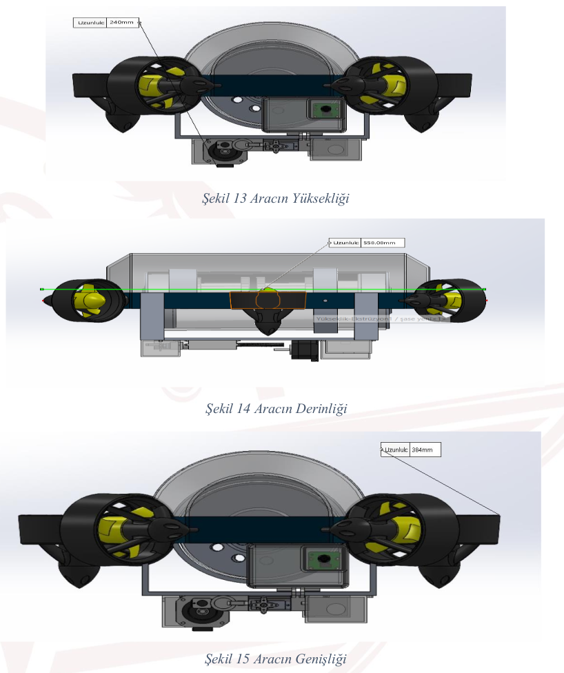
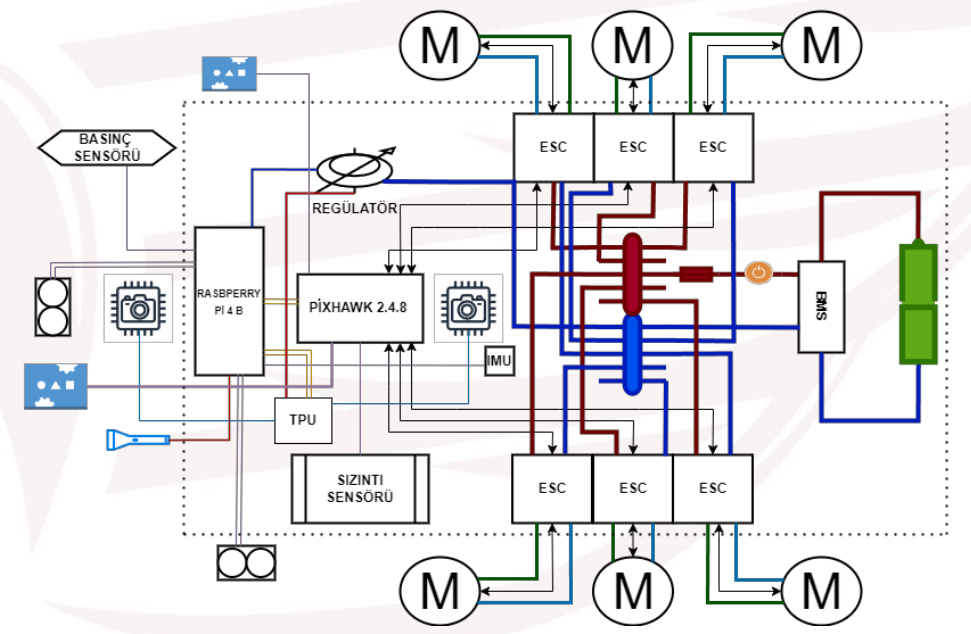
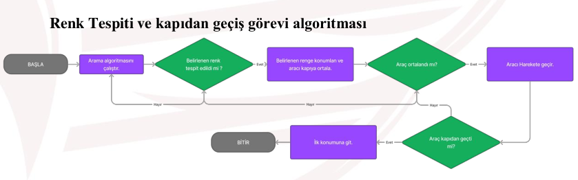
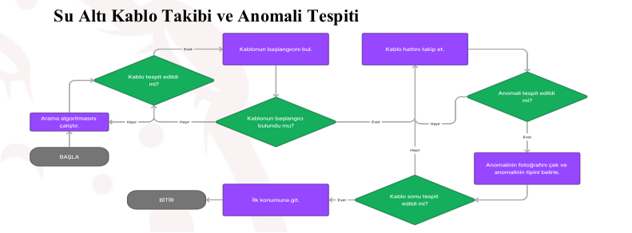
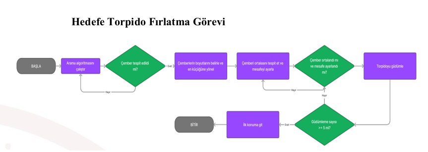
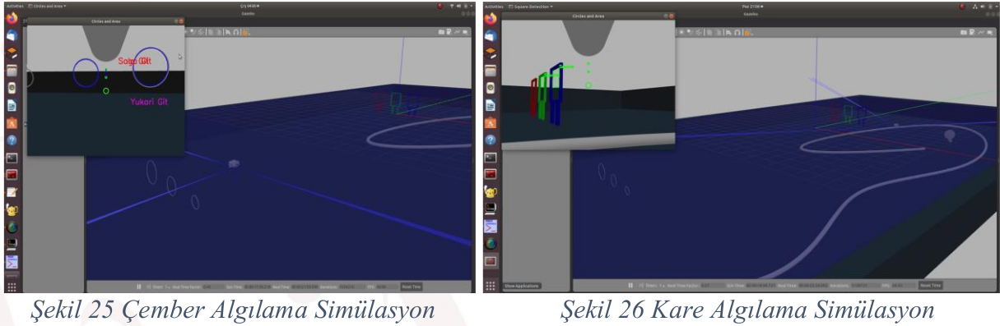
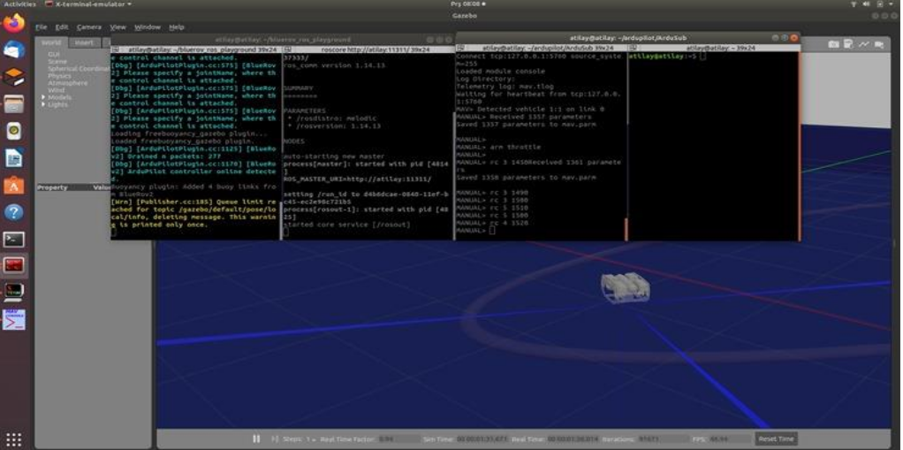
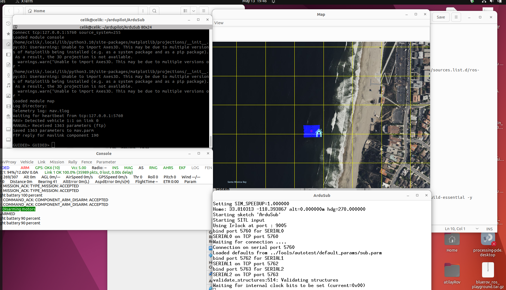
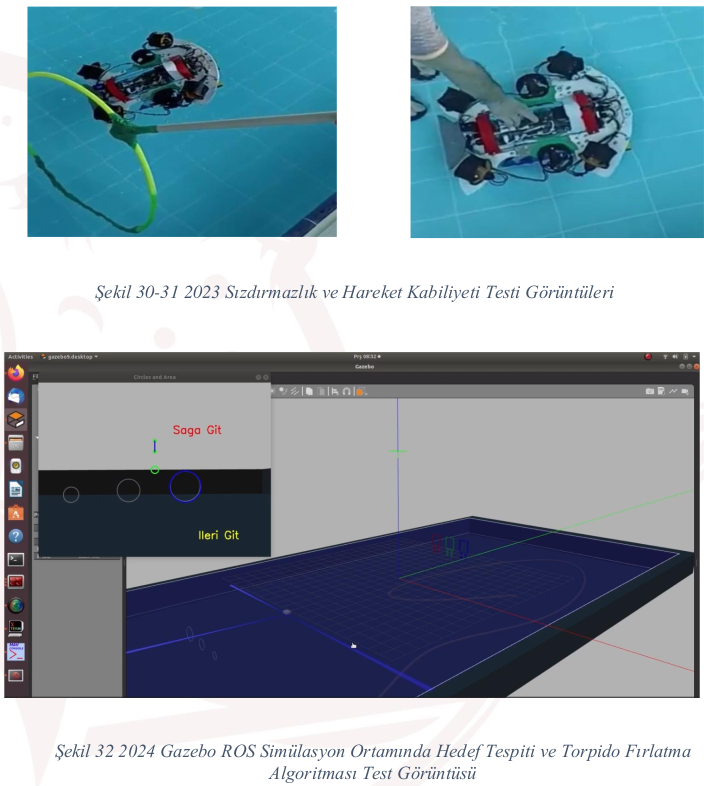
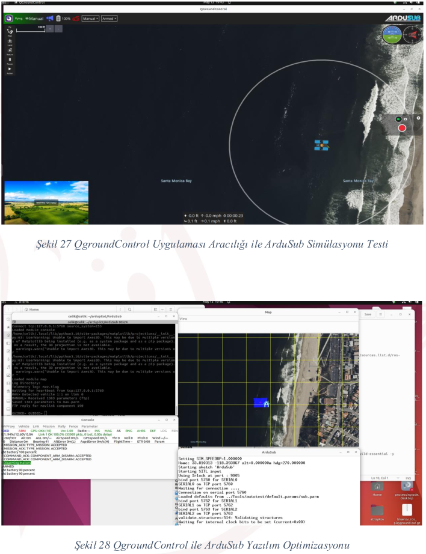

# ATILAY: Bilgi Paylaşımıyla Güçleniyoruz!

👋 Teknofest İnsansız Su Altı Otonom yarışmasında ATILAY takımı olarak yola çıkarken hedefimiz sadece yarışmayı kazanmak değildi. Aynı zamanda yazılım alanındaki bilgi birikimimizi siz yeni başlayanlarla paylaşarak Türkiye'deki kaynak sorununa çözüm bulmaktı. 🇹🇷

Bildiğiniz gibi, özellikle Türkçe kaynak bulmak oldukça zor olabiliyor. ATILAY olarak biz de bu zorluğun farkındayız. İşte bu yüzden edindiğimiz tüm bilgi ve tecrübeleri sizlerle paylaşarak bu sorunu aşmanıza yardımcı olmak istiyoruz.

İnancımız, gerçek gücün bilgiyi paylaştıkça artacağı yönünde! Günümüzün yapay zeka çağında, iş birliği ve bilgiye erişim her zamankinden daha önemli. Açık kaynak kod felsefesini benimseyerek "Windowsça değil, Linuxça" davranmayı ve hep birlikte gelişmeyi hedefliyoruz. 🐧

GitHub hesabımızda sizlerle paylaşacağımız kaynaklar; tecrübelerimizden faydalanmanız, sorular sormanız ve hep birlikte daha güçlü bir yazılım topluluğu oluşturmanız için bir fırsat sunuyor! 💻

Unutmayın, bilgi paylaştıkça çoğalır! ✨

# ATILAY: 2024 TEKNOFEST İnsansız Su Altı Sistemleri Yarışması

## 🏆  ATILAY Takımı

**Bu proje, 2024 TEKNOFEST İnsansız Su Altı Sistemleri Yarışması'nda "İleri Kategori"de yarışmak için oluşturulan ATILAY Takımı tarafından gerçekleştirilmektedir.**

**Takımımız:**

* **[Takım Üyelerinin Adları ve Rolleri]** 
* **Danışman:** [Danışmanın Adı ve Ünvanı]

**Başvuru ID:** 1295858

## 🚀  Proje Hedefi: Sualtı Keşif ve Operasyonlarda Yenilikçi Çözümler

**ATILAY** olarak, ülkemizin deniz kaynaklarını daha iyi keşfetmek, denizaltı araştırmalarını geliştirmek ve acil durumlarda hızlı müdahaleyi sağlamak için **insansız su altı sistemleri teknolojisine** odaklanmış, yenilikçi bir proje geliştirdik. 

**Projemizin temel amacı, sualtı araçlarına, GPS sinyallerinin ulaşamadığı ortamlarda da güvenli ve etkili bir konumlandırma yeteneği kazandırmaktır.** Bu sayede, sualtı keşifleri ve operasyonları daha verimli, güvenli ve maliyet etkin hale gelecektir.

## ⚙️  ATILAY: Sualtı Araçları için Arttırılabilir Menzilli Konumlandırma Sistemi (AMKS)

**AMKS**, sualtında ses dalgalarını kullanarak, ikili sayılarla kodlanmış zaman bilgisi ile aracın konumunu belirleyen yenilikçi bir sistemdir.

**AMKS'nin temel özellikleri:**

* **Uzun Menzil:**  Sinyal güçlendirici sayesinde, AMKS geleneksel sistemlere göre daha uzun mesafelerde konum belirleme olanağı sağlar.
* **Taşınabilirlik:**  İstasyonlar, aracın boyutuna göre ölçeklendirilebilir ve istenilen konuma yerleştirilebilir.
* **Maliyet Etkinliği:**  AMKS, LBL, SBL ve USBL sistemlerine kıyasla daha düşük maliyetlidir.
* **Güvenlik:**  Aracın konumunu belirlemek için birden fazla istasyon ve iki yönlü ölçüm gerektirmez.
* **Gizlilik:**  AMKS, pasif sonar prensibiyle çalıştığı için aracın konumunu aktif olarak ifşa etmez.

## 🤖  Yazılım ve Algoritmalar

**AMKS'nin çekirdeğini, güçlü bir yazılım ve algoritma seti oluşturmaktadır:**

* **Raspberry Pi 4:**  Aracın beyni olarak görev yapar, sensör verilerini işler, algoritmaları çalıştırır ve kontrol sinyalleri üretir.
* **Google Coral Devletme Kartı:**  Görüntü işleme ve derin öğrenme uygulamaları için kullanılır.  
* **Python:** Ana programlama dili olarak seçilmiştir, zengin kütüphaneleri ve kolay kullanım imkanı sunar. 
* **OpenCV:** Görüntü işleme ve analiz için kullanılır (örneğin, hedef algılama, renk tespiti).
* **NumPy:** Nümerik hesaplamalar için kullanılır (örneğin, matris işlemleri).
* **Pandas:** Veri analizi ve manipülasyonu için kullanılır (örneğin, sensör verilerini işlemek).
* **Scikit-learn:** Makine öğrenmesi algoritmaları için kullanılır (örneğin, anomalileri tespit etmek).
* **Matplotlib:** Veri görselleştirme için kullanılır (örneğin, model performansını analiz etmek).

**Kullandığımız algoritmalar şunlardır:**

* **Arama ve Tarama Algoritması:** Araç, havuzun haritasını çıkararak hedefleri belirler ve tekrar taramaktan kaçınır.
* **Renk Tespiti ve Kapıdan Geçiş Algoritması:**  Aracın belirli renkleri tespit ederek, kapıdan geçmesini sağlar. 
* **Su Altı Kablo Takibi ve Anomali Tespiti Algoritması:**  Aracın su altı kablosunu takip etmesini ve üzerindeki anomalileri tespit etmesini sağlar.
* **Hedefe Torpido Fırlatma Algoritması:** Aracın hedefleri tespit etmesini ve torpidoları fırlatmasını sağlar.

## 📡  Sensörler

**AMKS'nin donanımını oluşturan sensörler:**

* **LIDAR-Lite v3HP:**  Yüksek hassasiyetli optik mesafe ölçüm sensörü (uzak mesafe ölçümü için).
* **TF03 (ToF) Lazer Mesafe Sensörü:**  Toz geçirmez, suya dayanıklı, 180m'ye kadar ölçüm yapabilen lazer sensörü (yakın mesafe ölçümü için).
* **Gravity BMX160+BMP388 10 DOF Sensör:**  İvmeölçer, jiroskop ve manyetometre  (aracın yönünü ve pozisyonunu belirlemek için).
* **Derinlik Basınç Sensörü:**  Aracın derinliğini ölçmek için kullanılır.
* **Ultrasonik Sensör:**  Aracın çevresindeki engelleri tespit etmek için kullanılır (yakın mesafe).
* **ELP 100 Derece Bozulma Yok HD Kamera Modülü:**  Sualtı görüntüleme için kullanılır (hedef tespiti, çevre analizi).
* **Sızıntı Sensörü:**  Su geçirmez haznede oluşabilecek sızıntıları tespit etmek için kullanılır.

## 🔌  Güç Yönetimi

**AMKS, enerji tasarrufu sağlayan bir güç yönetim sistemi kullanmaktadır:**

* **Markalonya 5000mAh 3.7 V 26650 Li-lon şarj edilebilir pil:**  Aracın enerji kaynağı.
* **3S 12.6V 4A Li-ion & Lipo Pil Şarj Devresi:**  Pilleri şarj etmek için kullanılır.
* **Elektronik Hız Sürücüsü (ESC):**  Motorların hızını ve yönünü kontrol eder.

## 🗺️  Proje Geliştirme Aşamaları

* **Sistem Tasarımı:**  AMKS'nin yapısal tasarımı, sensör seçimi, güç yönetimi, iletişim protokolleri gibi konuları kapsamaktadır.
* **Mekanik Tasarım:**  Aracın gövdesi, pervaneler, iticiler, su geçirmez hazne ve diğer mekanik parçalarının tasarımı ve üretimi.
* **Elektronik Tasarım:**  AMKS'nin elektronik bileşenlerinin seçimi, devre tasarımının yapılması ve prototipin oluşturulması.
* **Algoritma ve Yazılım Tasarımı:**  AMKS'nin otonom çalışmasını sağlayan algoritmaların geliştirilmesi, yazılım kodunun yazılması ve simülasyonlar.
* **Test ve Entegrasyon:**  Sistemin, laboratuvar ve havuz testlerinde denetlenmesi ve entegre edilmesi.

##  📸  Proje Görselleri

#Araç Tasarımı

#Algoritmalar

#Didörtgen Tespiti

#Simülasyonlar

#Kontrol İstasyonu

## 🤝  Katkıda Bulunma

ATILAY projesine katkıda bulunmak isterseniz, lütfen [GitHub repo linki](https://github.com/OmerFaruk-Celik/ATILAY) adresinden iletişime geçin.

## 📄  Lisans

Bu proje [Lisans Türü] lisansı altında yayınlanmıştır.

##  🎉  Teşekkür

Bu projeyi destekleyen TEKNOFEST'e ve projede çalışan tüm kişilere teşekkür ederiz. 

##  🌍  İletişim

* **[Takım E-posta Adresi]**
* **[Takım Web Sitesi Bağlantısı]**
